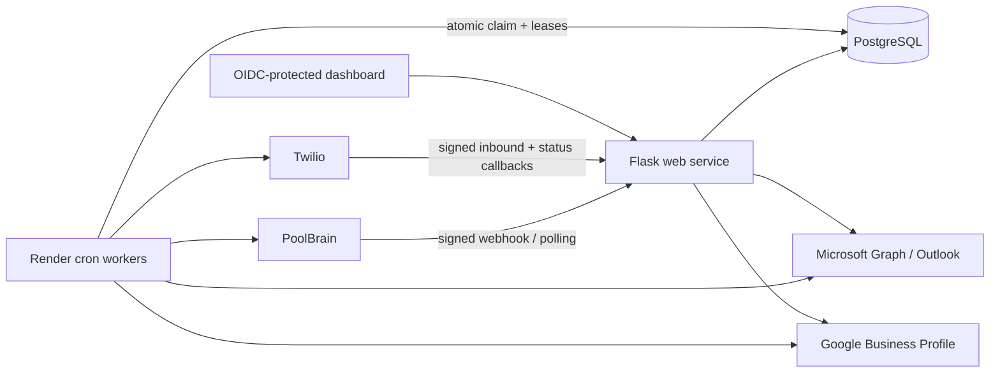

# Tampa VIP Customer Communication Automation

Production-oriented automation for Tampa VIP Pool Services. It receives signed PoolBrain and
Twilio webhooks, sends operational SMS messages, runs a Google review campaign, follows up by
Outlook email, tracks delivery and replies, imports Google reviews, and suppresses future messages
when a customer opts out or a review is confirmed.

The project replaces the previous single-file application with explicit modules, versioned database
migrations, durable queues, atomic worker claims, provider reconciliation, structured logging,
privacy retention, automated tests, and infrastructure as code.

## Customer workflow

1. A completed PoolBrain job is discovered during the configured lookback window.
2. The completed-service SMS is queued immediately.
3. If no active/recent/confirmed campaign suppresses it, a review campaign is created atomically.
4. The review SMS is scheduled three hours after completion.
5. The first Outlook follow-up is scheduled for 10:00 AM local time the next day.
6. The final Outlook follow-up is scheduled for 10:00 AM on the first Saturday strictly after that
   first email.
7. Any customer SMS reply completes the campaign and cancels pending reminders.
8. STOP and equivalent keywords suppress SMS and cancel pending campaign messages. Email
   unsubscribe suppresses review email only.
9. A confirmed or uniquely matched Google review cancels all pending reminders and prevents later
   review requests for that customer.

Clicks alone do not stop reminders because opening the Google page does not prove that a review was
submitted. Google matching is deliberately conservative: exact unique matches may be automated;
ambiguous candidates remain visible for administrator approval.

## Architecture



The database is the source of truth. Webhook handlers validate and store events before returning.
Workers claim due records with `FOR UPDATE SKIP LOCKED`; a unique idempotency key protects every
message. A provider-accepted message whose database acknowledgement is uncertain is marked
`delivery_unknown` and is never blindly resent.

## Repository map

- `app/routes`: public, provider webhook, OAuth, health, and authenticated dashboard routes.
- `app/services`: PoolBrain, Twilio, Microsoft Graph, and Google API clients.
- `app/repositories`: PostgreSQL persistence and atomic state transitions.
- `app/domain`: pure scheduling, matching, retry, contact, and bounce rules.
- `app/workers.py`: pollers, event processors, message delivery, review sync, and bounce sync.
- `migrations`: Alembic schema and safe legacy-data import.
- `tests`: unit tests plus PostgreSQL integration tests.
- `render.yaml`: web, cron, and PostgreSQL infrastructure definition.
- `docs`: deployment, operations, and detailed design documentation.

## Local setup

Requirements: Python 3.12 and PostgreSQL 16 or newer.

```bash
python3.12 -m venv .venv
.venv/bin/pip install --require-hashes -r requirements-dev.lock
.venv/bin/pip install --no-deps --no-build-isolation -e .
.venv/bin/pre-commit install
cp .env.example .env
```

Export the values from `.env`, create the database, then run:

```bash
alembic upgrade head
gunicorn 'app:create_app()' --bind 127.0.0.1:8000
```

Generate application secrets independently:

```bash
python -c "import secrets; print(secrets.token_urlsafe(48))"
python -c "from cryptography.fernet import Fernet; print(Fernet.generate_key().decode())"
```

Never commit real credentials. `TOKEN_ENCRYPTION_KEY` must be the same on the web service and every
worker; changing it without a token-rotation procedure makes stored OAuth credentials unreadable.

## Quality checks

```bash
.venv/bin/ruff check app migrations tests
.venv/bin/ruff format --check app migrations tests
.venv/bin/mypy app
.venv/bin/python -m pytest --cov=app --cov-report=term-missing --cov-fail-under=40
.venv/bin/python -m pip_audit --strict --no-deps --disable-pip -r requirements.lock
.venv/bin/python -m build --no-isolation
```

PostgreSQL integration tests run when `TEST_DATABASE_URL` is set. GitHub Actions provisions
PostgreSQL 16, applies the migration, runs all tests, audits production dependencies, and builds the
package. Configure the `main` branch so both CI jobs must pass before Render deploys.

## Provider endpoints

- PoolBrain: `POST /webhooks/poolbrain`
- Tampa VIP website leads: `POST /webhooks/website-lead` with an
  `X-Tampa-VIP-Signature` SHA-256 HMAC of the raw JSON body
- Twilio incoming messages: `POST /webhooks/twilio/inbound`
- Twilio status callback: generated per message as
  `/webhooks/twilio/status?job_id=<internal-id>`
- Microsoft change notifications: `GET|POST /webhooks/microsoft`
- Google review tracking: `GET /review/<opaque-token>`
- Email unsubscribe confirmation/action: `GET|POST /unsubscribe/<opaque-token>`
- Liveness/readiness: `GET /health/live`, `GET /health/ready`
- Dashboard: `GET /admin/dashboard`

Legacy webhook paths are retained only where an existing provider configuration needs a controlled
transition. All provider mutations require a valid signature or client-state secret.

## Commands

```text
python -m app.cli process-all
python -m app.cli poll-completed-services
python -m app.cli process-inbound-events
python -m app.cli process-messages
python -m app.cli recover-stale-work
python -m app.cli sync-google-reviews
python -m app.cli sync-outlook-bounces
python -m app.cli initialize-baseline --confirm
python -m app.cli backfill-campaign-contacts --limit 50
python -m app.cli migrate-legacy-google-token --delete-plaintext
python -m app.cli retention-cleanup
```

Do not run `initialize-baseline --confirm` until the old completed-job scheduler is stopped and the
current PoolBrain jobs have been reviewed. The baseline intentionally records current completed jobs
without contacting those customers.

## Implementation status

- [x] Secure public/admin endpoints and validate PoolBrain/Twilio/Microsoft callbacks.
- [x] Add durable events, message outbox, leases, idempotency, attempts, and stale-work recovery.
- [x] Correct the completed-job boundary with an explicit configurable lookback.
- [x] Validate positive PoolBrain alert/customer/job identifiers.
- [x] Synchronize Twilio failure callbacks to review campaigns and administrator alerts.
- [x] Correct dashboard date calculations in the business timezone.
- [x] Add current SMS/email preferences plus immutable preference history.
- [x] Backfill missing customer names and normalized contact data.
- [x] Refactor the single file into routes, services, repositories, domain rules, and workers.
- [x] Add Outlook collection, next-day/Saturday scheduling, multipart email, unsubscribe, and bounce
  handling.
- [x] Add Google OAuth token renewal, paginated review import, conservative matching, and manual
  confirmation/undo.
- [x] Add PII-safe structured logs, Sentry hooks, worker heartbeats, audit history, privacy retention, health
  checks, locked dependencies, CI, and deployment/runbook documentation.

Code completion does not itself switch production traffic. Follow `docs/DEPLOYMENT.md` for the
controlled cutover; Google review sync stays disabled until Google approves Business Profile API
access for the project.
